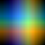
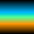
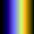

# Biome Map Compiler
This image compiler is designed to create biome maps for procedurally generated worlds. The program essentially collates input data in the form of images from both Heat maps and Moisture maps this information is then compiled into one universal map. The final output is a 2D graph with Heat on the Y axis and Moisture on the X axis.

These Biome Maps hold data about what objects can spawn and how densely they will spawn in any given climate.

## Heat Input Files

Each pixel on the Heat Maps represents which type of object it is via the use of the RGB channels and the brightness of each pixel determines the density of that object in the given heat climate.

|Heat Object|Heat Object|Heat Object|
|:-----------------------------------------:|:------------------------------------------:|:------------------------------------------:|
||||
|Mushrooms Heat Map                         |Trees Heat Map                              |Folliage Heat Map                           |
|*grows most densely in cooler temperatures*|*grows most densely in average temperatures*|*grows most densely in warmer temperatures* |

## Moisture Input Files

Each pixel on the Moisture Map represents which type of object it is bia the use of the RGB channels and the brightness of each pixel determines the density of that object in the given moisture climate.

|Moisture Object|Moisture Object|Moisture Object|
|:---------------------------------------:|:--------------------------------------------:|:--------------------------------------------:|
||||
|Mushrooms Moisture Map                   |Trees Moisture Map                       |Folliage Moisture Map                    |
|*grows most densely in moderate moisture*|*grows most densely in above average moisture*|*grows most densely in below average moisture*|

## Output Files

|Biome Map               |Heat Map             |Moisture Map              |
|:---------------------------:|:------------------------:|:----------------------------:|
||||
|*final compilation of inputs*|*compilation of heat maps*|*compilation of moisture maps*|

### Compilation Steps

1. 2-Dimensional arrays are created for each type of Moisture and Heat Map.
2. The arrays are then populated with the pixel data (RGB) from the respective Heat and Moisture map images.
3. A Moisture Map is created by compiling the individual object moisture maps.
4. A Heat Map is created by compiling the individual object heat maps.
5. The Moisture Map and Heat Map are compiled into one array by adding pixel values together and taking the average.

